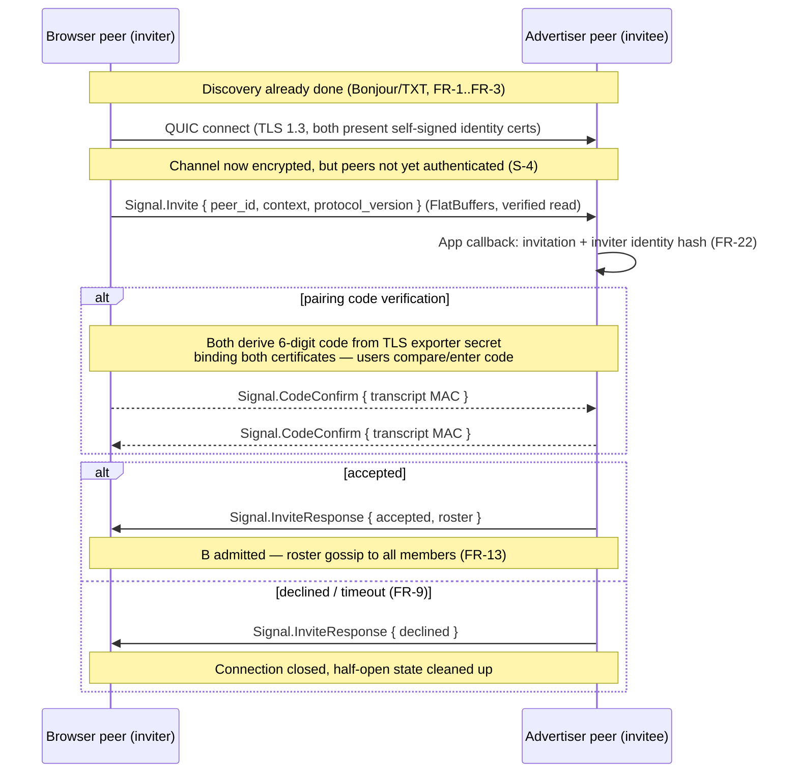
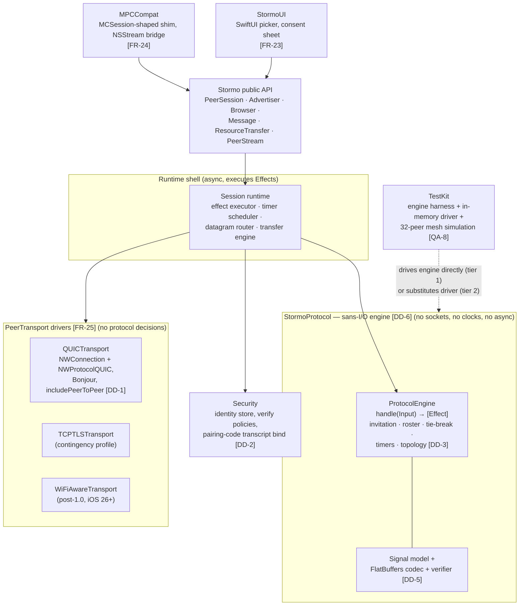
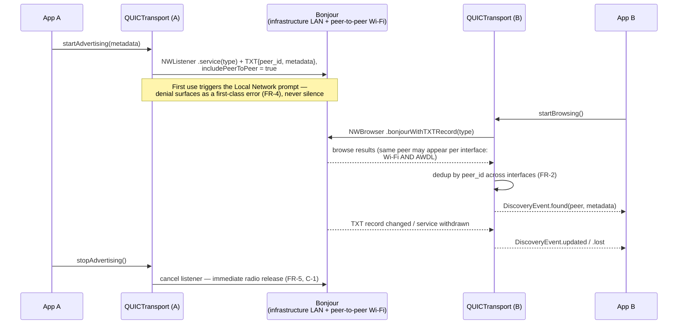
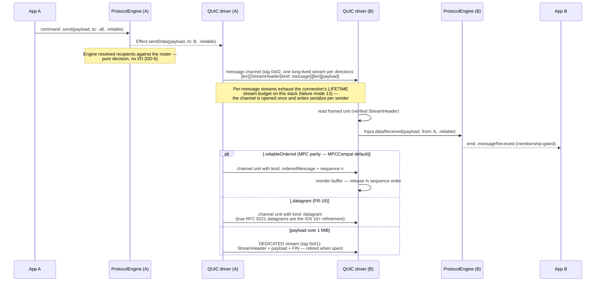
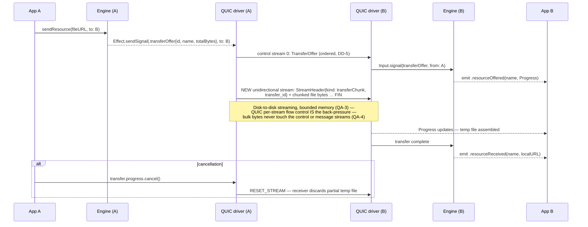
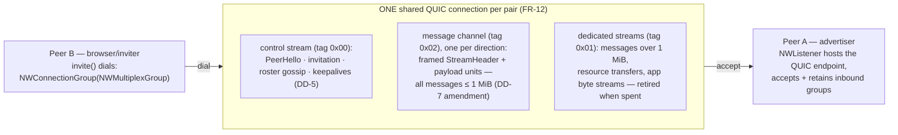
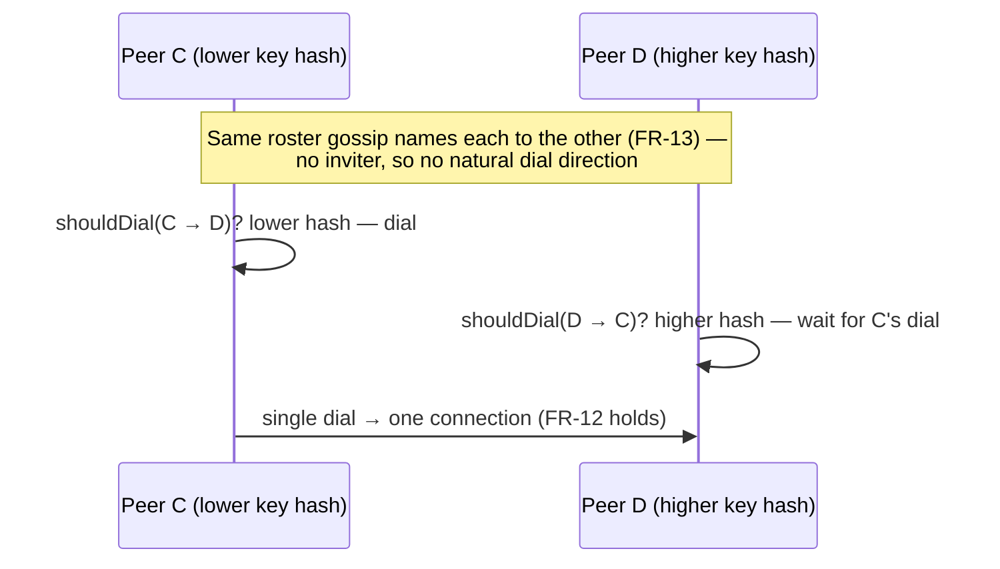
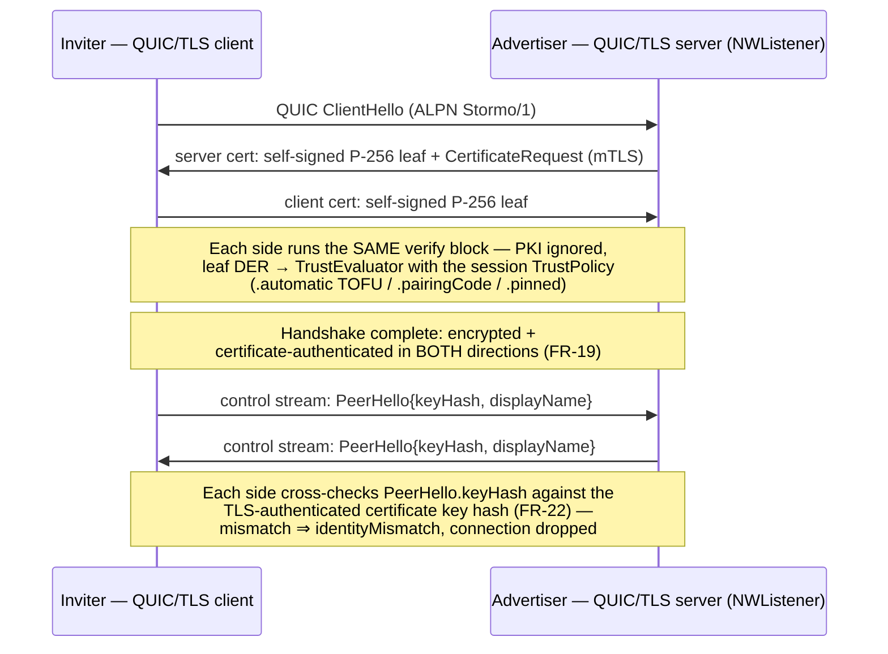

# Design Document: Stormo — A Modern Peer-to-Peer Session Framework for Apple Platforms

**Design Document — SU-2026-DD-001 (Draft 1)**

| | |
|---|---|
| **Prepared by** | Security Union (dario@securityunion.dev) |
| **Date** | July 25, 2026 |
| **Status** | Draft — requirements baselined; architecture in progress |
| **Companion document** | *Feasibility Study: A Third-Party Replacement for Apple's MultipeerConnectivity Framework* (SU-2026-TR-001) |

*Working name `Stormo` is a placeholder pending a trademark/Swift Package Index availability check. Quality attribute requirements use the SEI six-part scenario form (source – stimulus – artifact – environment – response – response measure).*

---

## 1. Purpose and Scope

Stormo is an open-source Swift package providing discovery, secure session establishment, and data exchange among nearby Apple devices, replacing the deprecated MultipeerConnectivity (MPC) framework. It consists of:

1. a **modern core** built on Network.framework with Swift 6 structured concurrency (`async`/`await`, `AsyncSequence`), QUIC as the primary transport; and
2. an **`MPCCompat` shim** offering a near-drop-in migration surface for existing MPC code.

In scope: local-proximity networking over infrastructure LAN and peer-to-peer Wi-Fi (AWDL), session/mesh membership beyond MPC's 8-peer limit, reliable/unreliable messaging, byte streams, resource transfer, authenticated encryption, SwiftUI discovery/invitation components, and the compat shim. Out of scope for 1.0: internet-wide P2P (NAT traversal/relays), Android interop, multi-hop mesh routing (listed as a post-1.0 direction), and Bluetooth transport (not offered by any current Apple API — see companion study §4.1).

## 2. Stakeholders and Context

| Stakeholder | Concern |
|---|---|
| Migrating MPC app teams | Minimal-diff migration; behavioral parity; App Store safety |
| Greenfield app developers | Idiomatic Swift 6 API; SwiftUI integration; more than 8 peers |
| Security reviewers/auditors | Explicit threat model; modern AEAD/TLS 1.3; no MPC-style cleartext authorization |
| Maintainers (Security Union) | Small testable core; pluggable transports; bounded per-OS regression surface |
| Apple platform | Public API only (`includePeerToPeer`, Bonjour, QUIC); entitlement and Local Network privacy compliance |

---

## 3. Functional Requirements

Priority: **M** = must (1.0), **S** = should (1.x), **C** = could (post-1.0).

### 3.1 Discovery and Advertising

- **FR-1 (M)** A peer SHALL advertise a service (app-defined service type) with an attached metadata dictionary (≥ 400 bytes usable), implemented as Bonjour TXT records via `NWListener`, visible on infrastructure LAN and peer-to-peer Wi-Fi simultaneously.
- **FR-2 (M)** A peer SHALL browse for peers advertising a given service type and receive an `AsyncSequence` of discovery events (found / updated metadata / lost), deduplicated across network interfaces.
- **FR-3 (M)** Discovery SHALL function with **no network infrastructure present** — both devices unassociated to any access point — using peer-to-peer Wi-Fi (`includePeerToPeer`). *(This is the scenario iOS 26 broke in MPC; it is a headline requirement, not an edge case.)*
- **FR-4 (M)** The framework SHALL surface Local Network permission state (undetermined/denied) as a first-class, observable condition rather than silent discovery failure.
- **FR-5 (S)** Advertising and browsing SHALL be independently start/stoppable with immediate radio release (per TN3213 guidance to stop P2P operations promptly).

### 3.2 Session Establishment (Invitation)

- **FR-6 (M)** A browsing peer SHALL be able to invite a discovered peer to a session, attaching an opaque application context payload (≥ 64 KB).
- **FR-7 (M)** The invited peer SHALL receive the invitation (peer identity + context) and accept or decline programmatically; the framework SHALL NOT require any system pairing UI.
- **FR-8 (M)** Invitation SHALL complete over an already-secured channel (see FR-19); context payloads SHALL never transit in cleartext.
- **FR-9 (S)** Invitations SHALL support an application-defined timeout with automatic cleanup of half-open state.

### 3.3 Session, Membership, and Topology

- **FR-10 (M)** A session SHALL support **at least 32 concurrently connected peers in full-mesh topology** (vs. MPC's 8), with membership events (joined/left/unreachable) delivered as an `AsyncSequence`.
- **FR-11 (S)** A session SHALL support a **relayed (host-star) topology mode for at least 128 peers**, where an elected or designated host forwards traffic; topology is a session-configuration choice, transparent to the messaging API.
- **FR-12 (M)** Exactly one transport connection SHALL exist per peer pair (deterministic dial-direction tie-break on peer ID), regardless of simultaneous mutual discovery.
- **FR-13 (M)** A joining peer SHALL learn the current session roster within one round-trip of admission (roster gossip on the control stream); all members SHALL converge on membership within 2 seconds under nominal conditions.
- **FR-14 (S)** Sessions SHALL survive individual peer churn: any peer leaving (gracefully or by timeout) SHALL NOT disturb connections among remaining peers.

### 3.4 Data Exchange

- **FR-15 (M)** **Reliable messaging:** back-pressured message send to one, a subset, or all session peers (messages up to 16 MB; larger payloads directed to FR-17), carried as framed `StreamHeader` + payload units on the persistent per-direction **message channel** (DD-7 hardware amendment; payloads > 1 MiB ride a dedicated stream per message). Two reliable modes: `.reliable` (default; delivery guaranteed, ordering across messages not guaranteed) and `.reliableOrdered` (FIFO per sender–receiver pair via sequence numbers; MPC behavioral parity, used by `MPCCompat`).
- **FR-16 (M)** **Unreliable messaging:** low-latency datagram send; silently droppable, unordered, and **capped at `Delivery.maxDatagramPayload` (1200 bytes)** — datagrams never fragment, and sends over the cap throw `datagramTooLarge` directing callers to `.reliable`. Larger droppable data is an application-layer concern (supersede over `.reliable`). `MPCCompat` degrades oversized MPC `.unreliable` sends to `.reliable` (unordered) — MPC allowed them only via fragile IP fragmentation.
- **FR-17 (M)** **Resource transfer:** file/URL transfer to a peer with **live byte-counting `Progress` on BOTH ends** — the sender's returned `Progress` advances as chunks are written (back-pressured), the receiver's as bytes land; `MPCCompat.sendResource` returns the sender's `Progress` with `MCSession` unit semantics (total = file bytes), so existing progress-bar code works unchanged. Cancellation from either `Progress`; bounded memory (streaming from/to disk, never whole-file in memory); a dedicated QUIC stream per transfer so bulk transfers never head-of-line-block messaging.
- **FR-18 (M)** **Byte streams:** application-opened named bidirectional streams exposed as `AsyncSequence<Data>` + async writer with explicit back-pressure; each maps to its own QUIC stream. (`NSStream` bridging only via `MPCCompat`, FR-24.)

### 3.5 Security

- **FR-19 (M)** All traffic — including discovery-to-invitation handshake — SHALL be encrypted with TLS 1.3 (QUIC-native). There SHALL be **no plaintext mode** (deliberately dropping MPC's `.none`/`.optional`).
- **FR-20 (M)** Each peer SHALL hold a long-lived local cryptographic identity (P-256, Secure Enclave-backed where available) presented as a self-signed certificate; the **peer ID SHALL be derived from the public key** (unforgeable, unlike `MCPeerID`).
- **FR-21 (M)** Peer authentication SHALL offer three modes, and the **default SHALL require zero configuration and zero user-visible cryptography** (MPC-ergonomics parity):
  - `.automatic` (**default**) — identity auto-generated and persisted on first use; any peer certificate accepted with its key hash recorded; authorization = the user accepting the invitation (exactly MPC's `encryptionPreference = .required` model, plus TOFU identity-continuity warnings MPC never had). Encrypted always; unauthenticated against an active MITM, as MPC was.
  - `.pairingCode` (opt-in) — short-code confirmation: identities exchanged in-handshake, then mutually verified by a code derived from the TLS exporter/transcript binding both certificates (defends against MITM without PKI; replaces TN3213's TLS-PSK pattern, which QUIC does not support).
  - `.pinned` (opt-in) — app-provisioned trust (pinned certificates or app CA) for managed fleets; verification via `sec_protocol_options_set_verify_block`.
- **FR-22 (M)** The application SHALL receive a verification callback with the peer's certificate/key hash before session admission (parity with MPC's `didReceiveCertificate`, with real semantics).

### 3.6 UI Components and Compatibility

- **FR-23 (S)** SwiftUI components: a peer browser/picker view and an invitation-consent sheet (replacing `MCBrowserViewController` / `MCAdvertiserAssistant`), fully restyleable, built solely on public Stormo APIs.
- **FR-24 (S)** **`MPCCompat` module:** near-drop-in analogs of `MCSession`, `MCPeerID`, `MCNearbyServiceAdvertiser/Browser` delegate semantics (original type names, no `MC` prefix; migration = mechanical rename), including `NSStream`-bridged streams and 8-peer-limit emulation flag for behavioral parity testing.
- **FR-25 (C)** Pluggable transport backends behind a `PeerTransport` protocol: QUIC/Bonjour (1.0), TCP+TLS fallback profile (contingency), Wi-Fi Aware backend for paired-device scenarios on iOS 26+ hardware (post-1.0).

---

## 4. Quality Attribute Requirements (SEI six-part scenarios)

| ID | Attribute | Scenario (source → stimulus → artifact → environment → response → **measure**) |
|---|---|---|
| **QA-1** | Availability (infrastructure-less operation) | Two devices, Wi-Fi radios on but **associated to no access point**, attempt discovery + session join (peer-to-peer Wi-Fi only) → framework establishes a secured session → **≥ 99% first-attempt success within 5 s across the supported device matrix; zero scenarios requiring user retry loops** (contrast: MPC on iOS 26 requires up to ~20 retries). |
| **QA-2** | Scalability (session size) | Application opens a session; peers join sequentially → full-mesh topology sustains **32 peers** with membership convergence < 2 s per join; relayed topology sustains **128 peers** with host CPU < 50% of one core on an A14-class device. |
| **QA-3** | Performance (throughput) | Peer sends a 1 GB resource over peer-to-peer Wi-Fi, devices ~3 m apart → transfer streams disk-to-disk → **≥ 60% of iperf3-measured link capacity between the same devices; sender and receiver memory high-water mark < 32 MB attributable to the transfer** (fixes MPC drawbacks #2/#3). |
| **QA-4** | Performance (latency) | Peer sends 256-byte unreliable datagrams at 60 Hz during an active bulk transfer (FR-17) on the same connection → **p95 one-way latency ≤ 25 ms; datagram path never blocked by bulk streams** (QUIC stream isolation). |
| **QA-5** | Availability (churn/roaming) | A 12-peer session; one peer force-quits, another backgrounds, a third roams from LAN to peer-to-peer path → remaining peers' connections **unaffected; departed-peer detection ≤ 5 s; no cascading disconnects** (fixes MPC's session-collapse behavior). |
| **QA-6** | Security | An on-path attacker on an open Wi-Fi network attempts to read or MITM the invitation handshake in `.pairingCode` mode → attack is detected/prevented by transcript-bound code verification → **no plaintext application bytes on the wire ever (verified by packet capture in CI); MITM success requires guessing the code online, ≤ 1 attempt per connection** (contrast: MPC's cleartext-hostname authorization weakness). |
| **QA-7** | Modifiability (transport evolution) | Maintainer adds a Wi-Fi Aware backend → change confined to a new `PeerTransport` conformance + capability gating → **zero changes to session, security, messaging, or UI modules; core compiles without the new backend**. |
| **QA-8** | Testability | CI runs on every commit without physical devices → handshake, mesh membership, topology election, timers, and transfer signaling execute as deterministic sans-I/O engine simulations (DD-6), plus real-QUIC loopback integration tests → **≥ 85% line coverage of non-radio code; full 32-peer mesh simulation in < 60 s on a CI runner; any recorded device-session input log replays deterministically into the engine**. |
| **QA-9** | Usability (migration) | An MPC app of moderate complexity (advertise+browse+session+send) migrates to `MPCCompat` → **≤ 1 day of work, no architectural changes; diff limited to imports/type renames + Info.plist keys**, validated by a published ported sample app. |
| **QA-10** | Compatibility (OS floor) | App integrates Stormo 1.0 → runs on **iOS 15+/iPadOS 15+/macOS 12+/tvOS 15+/visionOS 1+** (QUIC floor); Wi-Fi Aware features degrade gracefully with runtime capability checks. |
| **QA-11** | Interoperability (protocol evolution) | A device running an app built against Stormo 1.0 joins a session whose other peers run Stormo 1.x (newer signaling schema) → signaling interoperates via FlatBuffers evolution rules (DD-5): unknown fields skipped, unknown union variants ignored-and-logged → **session forms and all 1.0-era features function; zero connection failures attributable to schema version skew, proven by golden-file cross-version tests in CI**. |

---

## 5. Constraints (platform-imposed)

- **C-1** AWDL is reachable only via `NWParameters.includePeerToPeer`; path selection is Happy-Eyeballs-driven and cannot be forced to prefer the P2P path.
- **C-2** No Bluetooth data transport exists for third-party apps; Stormo makes no Bluetooth claims.
- **C-3** QUIC in Network.framework supports **PKI only, not TLS-PSK** (TN3213) → drives FR-21's identity design.
- **C-4** `NSLocalNetworkUsageDescription` + `NSBonjourServices` required; standard Bonjour needs no multicast entitlement; Wi-Fi Aware backend would additionally need its entitlement + plist declarations.
- **C-5** iOS backgrounding suspends advertising/browsing and connections (except future Wi-Fi Aware paired scenarios); the API must make suspension/resume explicit.
- **C-6** Public API only; no private frameworks, no AWDL SPI.

---

## 6. Key Design Decisions

### DD-1: QUIC as the primary transport — **adopted**

One QUIC connection per peer pair carries everything:

| Session concern | QUIC mechanism |
|---|---|
| Control plane (invitation, roster gossip, keepalive, topology election) | Bidirectional **control stream 0** (persistent — signaling requires total order), size-prefixed **FlatBuffers** signal messages (DD-5) |
| Reliable messages (FR-15) | Framed `StreamHeader` + payload units on the persistent per-direction **message channel** (DD-7 hardware amendment); payloads > 1 MiB ride a dedicated stream |
| Unreliable messages (FR-16) | ≤ 1200-byte payloads only (enforced — datagrams never fragment): `StreamKind.Datagram` units on the message channel today; RFC 9221 datagrams (iOS 16+/macOS 13+) are the latency refinement |
| Resource transfers (FR-17) | One unidirectional stream per transfer (`StreamHeader.kind = transferChunk`) — native per-stream flow control, no head-of-line blocking of messages |
| App byte streams (FR-18) | One bidirectional stream each (`StreamHeader.kind = appStream`) |
| Encryption (FR-19) | TLS 1.3, mandatory, connection-level |

**Rationale:** QUIC structurally eliminates MPC drawbacks #2 (throughput), #3 (no flow control), and #7 (PKI deployment pain is addressed by DD-2 rather than by weakening crypto). It replaces TN3213's recommended WebSocket+negotiated-UDP dual-connection pattern with a single connection, halving the mesh's connection count and removing the reliable/unreliable state-sync problem.
**Risks accepted:** (a) QUIC-over-AWDL is unvalidated → **Spike S-1**, with the TCP+TLS profile (FR-25) as contingency; (b) iOS 15 floor (acceptable in 2026); (c) datagram availability/max-size behavior on AWDL → Spike S-1 measures it.

### DD-2: Self-signed identities + three verification modes (replaces TLS-PSK) — **adopted**

Because of C-3, the WWDC19 passcode/PSK pattern is unavailable on QUIC. Instead: every peer has a persistent P-256 identity (FR-20); TLS always terminates against the peer's self-signed certificate; *authentication* is a policy layered on *encryption* (FR-21).

**The governing principle is MPC-ergonomics parity (FR-21):** MPC's celebrated simplicity was, concretely, *encrypted-but-unauthenticated by default* — `encryptionPreference = .required` auto-generated keys, and the de facto authorization was the user tapping Accept on the invitation (`didReceiveCertificate` accepted everyone unless overridden, and rarely was). Stormo's `.automatic` default reproduces exactly that developer and user experience on QUIC: the identity is generated and persisted silently, the self-signed certificate exists only to satisfy the QUIC handshake, the verify block accepts and records the peer key hash, and invitation consent is the authorization step. Zero configuration, no pairing ceremony — and two silent upgrades over MPC: unforgeable key-derived peer IDs, and TOFU continuity warnings if a known peer's key ever changes.

The opt-in `.pairingCode` mode binds a short user-visible code to the TLS transcript/exporter secret covering both certificates — a MITM cannot present matching codes on both sides. This is strictly stronger than MPC (which authorized on cleartext hostname) and stronger than bare PSK (identity continuity persists across sessions). It exists for apps that genuinely need active-MITM resistance; it is deliberately not the default, because MPC never had it either and imposing a ceremony on every session would betray the framework's reason to exist.

Invitation flow in `.pairingCode` mode (FR-6..FR-9, FR-19..FR-22):



### DD-3: Topology as a strategy, not a constant — **adopted**

`SessionTopology.fullMesh(maxPeers: 32)` (default; ≤ 496 total edges at 32 peers, each device ≤ 31 connections) and `.hostRelay(host:)` for large sessions (FR-11). Membership, tie-break dialing (FR-12), and roster gossip live above the transport and below messaging, so topology changes don't touch either. Post-1.0 direction: partial-mesh gossip overlay (C-range requirement).

### DD-4: Structured-concurrency-first API — **adopted**

All event delivery via `AsyncSequence`; all operations `async` with cancellation propagating to radio release (C-5, FR-5). Delegates exist only in `MPCCompat`. Aligns with WWDC25 guidance (structured concurrency with Network.framework).

### DD-5: Disciplined FlatBuffers for the signaling plane — **adopted**

All control-plane messages (identity bootstrap/PeerHello, invitation, accept/decline, roster gossip, keepalive, topology election, transfer/stream announcements) are FlatBuffers, generated from `.fbs` schemas that are the single source of truth in the repository. Version negotiation is semver carried once per connection in `PeerHello` (same-major interop; a mismatch surfaces as a typed "upgrade required" error naming both versions) — which is why the QUIC ALPN is frozen: bumping it would fail the handshake before hello and hide the diagnosis. `peer_hello.fbs` is therefore a frozen bootstrap contract every major version must parse. Application payloads (FR-15..FR-18) remain opaque bytes — apps serialize however they like; FlatBuffers governs only Stormo's own protocol.

**Rationale:** zero-copy access suits a hot control path on many concurrent connections; the schema compiler enforces cross-version wire compatibility mechanically (vs. convention-only discipline in CBOR/JSON); the built-in **verifier** gives structural validation of bytes received from *not-yet-authenticated* peers during the handshake — a security property the signaling path specifically needs; official Swift support ships via SPM (`google/flatbuffers`, `flatc --swift`).

**The discipline (normative rules, enforced in CI):**

1. **Envelope:** every control message is a size-prefixed `Signal` root table: `{ protocol_version: uint16, body: SignalBody (union) }`. Unknown union variants are ignored-and-logged, never fatal (forward compatibility).
2. **Evolution rules:** field ids are append-only; fields are never renumbered, retyped, or removed — only `(deprecated)`; no new `(required)` fields after 1.0; enum/union values are append-only with an explicit `UNKNOWN = 0` default; schema changes land only with a CI compatibility check (`flatc --conform` against the previous released schema).
3. **Verification:** every inbound buffer is read via the verifier (`getCheckedRoot`) with hard caps on buffer size (64 KB for control messages; invitation-context payloads chunked above that), table nesting depth, and vector lengths — malformed input from a peer terminates that connection, never traps the process. The verifier path is fuzzed in CI.
4. **Toolchain pinning:** the `flatc` version is pinned in the repo's `flake.nix` devShell; generated Swift sources are committed and CI fails if regeneration diffs (no drift between schema and code).
5. **Golden files:** serialized fixtures for every message type per released schema version, replayed in tests to prove old-wire → new-reader and new-wire → old-reader compatibility (backs QA-11).
6. **Zero-copy discipline:** inbound buffers are verified once, then read **in place** through the generated view accessors for their entire lifetime — signals are never unpacked into copied value types (no FlatBuffers object API). `Signal` is a wrapper owning the verified buffer; its `body` is an enum of *views*, preserving pattern-matching ergonomics at zero cost; the engine retains `Signal` values in state (buffers capped per rule 3) instead of extracting fields. Copies are permitted at exactly two boundaries: handing a payload to the application (which must own its data), and persisting identity fields (key hash, display name) into long-lived engine state. Outbound signals are built once with `FlatBufferBuilder` — the built buffer *is* the wire bytes. The flatc codegen version and the FlatBuffers Swift runtime version are pinned **together** (`exact:` in Package.swift + flake.nix) and bumped together.

**Alternatives considered:** CBOR (schema-by-convention only; no conformance tooling; weaker evolution guarantees), Protobuf (mature but copy-based decode and a heavier Swift runtime dependency), custom TLV (maximum control, but a hand-written parser on unauthenticated input is exactly where parser bugs become vulnerabilities). FlatBuffers-with-discipline dominates for this path.

### DD-6: Sans-I/O protocol engine — **adopted**

The entire session protocol — invitation state machine, roster/membership, topology election, tie-break dialing, timeout handling, transfer/stream announcement — is implemented as a **pure, deterministic state machine with no I/O dependencies**: no sockets, no clocks, no async, no Network.framework import. The pattern proven by `quinn-proto` (Rust QUIC) and `h11`/`h2` (Python HTTP).

```
ProtocolEngine.handle(Input) -> [Effect]        // synchronous, deterministic
```

- **Inputs:** app commands (invite/accept/send/leave), decoded signals received from a peer, connection lifecycle notifications (established/closed), timer expirations. Time never comes from a clock inside the engine — it arrives as input.
- **Effects:** open a connection to a peer, send a signal to a peer, send app data, start/cancel a named timer, deliver an event to the application, close a connection.
- **The runtime shell** (`PeerSession` + a `PeerTransport` driver) is the only async code: it executes effects against real QUIC and feeds transport events back in. Drivers contain no protocol decisions.

**What this buys (extends QA-7, QA-8):**

1. *Full protocol coverage without radios or QUIC:* invitation timeout (FR-9) without waiting 30 s, roster convergence (FR-13), simultaneous-dial tie-break (FR-12), and 32-peer mesh simulation (QA-2/QA-8) run as instant, synchronous unit tests by wiring engines back-to-back in memory.
2. *Deterministic replay:* a recorded input log from a failing device session replays into the engine byte-for-byte, turning "flaky P2P bug" into a reproducible state-transition test.
3. *Transport swaps touch zero protocol logic:* TCP+TLS contingency and Wi-Fi Aware are new drivers, not new protocol code — QA-7's measure becomes true by construction.
4. *Fuzzing surface:* the FlatBuffers verifier (DD-5) plus engine input fuzzing compose — malformed and adversarially sequenced signals are injected without any network.

**Test strategy (three tiers):**

| Tier | What runs | Where | Needs |
|---|---|---|---|
| 1. Engine (bulk of coverage) | `ProtocolEngine` + `SignalCodec`: state machine, timers, mesh simulation, fuzz, golden files | Every commit, CI | Nothing — pure Swift |
| 2. Integration | Real QUIC (`NWConnection`+`NWProtocolQUIC`) over **loopback** between two endpoints in-process: handshake, streams, datagrams, TLS identity | Every commit, macOS CI runner | No radios, no devices |
| 3. Hardware | AWDL/peer-to-peer Wi-Fi matrix: QA-1, QA-3, QA-4 measures; Spikes S-1/S-2/S-5 | Release gates + OS betas | Physical device lab |

> **Mesh reliability — validated in CI (2026-07).** The QA-2/QA-8 mesh
> targets are now asserted on every commit by
> `Tests/StormoTests/MeshReliabilityTests.swift`: a monotonic N = 3…32
> full-mesh sweep over `InMemoryTransport` (formation convergence, exactly-once
> delivery, payload integrity, sender attribution, per-sender ordering under a
> reordering transport, clean drain) plus a 3-peer **real-QUIC loopback**
> triangle whose size ladder crosses the message-channel ↔ dedicated-stream
> boundary (DD-7 hardware amendment) and proves the open/retire ledger
> balances. Measured: 32-peer sim ≈ 1.5 s (QA-8 budget 60 s); no reliability
> violations at any N. Full write-up and result tables in the test file
> header; the S-6 nightly benchmark remains the formal timing home. What this
> does NOT cover: real radios/AWDL (tier 3) and relayed topologies (QA-2's
> 128-peer target).

**Platform execution matrix (tiers 1–2):** the same test bundles run on every shipping target — macOS native via `swift test` (fast loop + coverage), and per-destination via `xcodebuild test -scheme Stormo-Package` against **iOS Simulator** and **Mac Catalyst** (tvOS/visionOS simulators when installed). This is the pattern used by swift-nio, Apple's own packages, and the major Swift OSS projects: one suite, N destinations, no per-platform test code. Network.framework QUIC works over loopback in the iOS Simulator and Catalyst, so tier 2 runs on all of them without radios. Aspirational tier-1 extension (FoundationDB-style deterministic simulation testing): seeded random command/interleaving exploration against engine invariants — the seed arrives as engine input, so any nightly failure reproduces exactly from its seed.

Module consequence: the engine, typed `Signal` model, and codec live in a dedicated **`StormoProtocol`** target whose only dependency is FlatBuffers; `Stormo` (runtime shell + drivers) depends on it — **the shipped `Stormo` product includes the QUIC integration**; consumers get working transport out of the box, and the protocol target stays importable on its own for tests and tooling. Under the AI-driven development model (study §4.4) this is the highest-leverage structural decision in the project: it moves the majority of correctness into tier 1, which is agent-buildable and agent-testable with zero device time.

### DD-7: Stream-per-message data plane (MoQ-inspired) — **adopted**

Every reliable application message travels on its **own unidirectional QUIC stream**: open, write `StreamHeader` + payload, FIN. This is the pattern Media over QUIC (moq-transport) uses for objects, and it exploits the property that QUIC stream IDs are effectively free (62-bit space; opening a stream costs no round trip).

**Wire format of every non-control stream:** a size-prefixed FlatBuffers `StreamHeader` (`Schemas/stream_header.fbs`: `kind` ∈ {message, orderedMessage, transferChunk, appStream}, optional `sequence`, `transfer_id`, `label`), followed by raw payload bytes; stream FIN delimits the message — no payload framing needed.

**Why:**

1. *Per-message isolation:* radio loss delaying one message's retransmission never delays any other message — a persistent messaging stream would reintroduce head-of-line blocking *between* messages, the very MPC pathology QUIC removes between channels.
2. *Per-message cancellation:* a stale message (superseded game state, aborted UI action) is dropped with `RESET_STREAM` — cheap, precise, exactly MoQ's object-drop semantics. Impossible on a shared stream.
3. *Receiver-side concurrency:* messages complete independently and can be processed as they finish, not in arrival-order lockstep.
4. *Natural delimiting:* FIN marks the end; no length-prefix state machine over a shared stream to fuzz or corrupt.

**Semantics consequence (surfaces in FR-15):** streams complete independently, so cross-message ordering is not guaranteed. `.reliable` (default) = guaranteed delivery, unordered across messages. `.reliableOrdered` = MPC-parity FIFO per sender–receiver pair: `StreamHeader.kind = orderedMessage` + `sequence`, with a receiver-side reorder buffer (bounded by messages in flight — reliable streams all eventually arrive, so the buffer only absorbs reordering, never loss). `MPCCompat` maps MCSession's `.reliable` → `.reliableOrdered` and `.unreliable` → `.datagram`.

**What stays on the persistent control stream:** all signaling (DD-5). Invitation/response pairing and roster epochs *require* total order — MoQ likewise keeps a persistent bidirectional control stream alongside per-object streams. Datagrams (FR-16) are unaffected.

**Costs/risks accepted:** ~30–50 bytes of `StreamHeader` overhead per message (negligible at 16 MB cap, measurable at 60 Hz tiny messages — datagrams are the right tool there anyway); per-stream open/teardown cost in Network.framework is unmeasured → **Spike S-6** (stream-churn rate; MoQ implementations sustain thousands of streams/sec, but `NWConnection`'s QUIC stream surface must be validated — interacts with S-3's multiplex-group question).

**Hardware amendment (failure mode 13) — messages ride a persistent channel.**
S-6 resolved against per-message streams on this platform: Apple's
`NWConnectionGroup` QUIC treats `initialMaxStreams*` as the connection's
*lifetime* stream budget (MAX_STREAMS is never extended as streams close), and
each spent stream costs a handle-retirement dance with reset-noise per
message. Messages of every delivery mode therefore travel on one persistent
per-direction **message channel** (stream tag `0x02`): repeating size-prefixed
`StreamHeader` + size-prefixed payload, written serially per sender. The
`StreamHeader` vocabulary, delivery semantics, and `.reliableOrdered` reorder
buffer are unchanged. Dedicated per-message streams remain for payloads above
the channel frame cap (1 MiB — preserves FR-15's 16 MB), and transfers/app
streams keep their own streams (QA-4: bulk never head-of-line blocks
messaging). Cost accepted: `.reliable` messages share the channel, so radio
loss can delay subsequent *small* messages at the transport level (rationale 1
above is traded away below 1 MiB); real RFC 9221 datagrams (TODO datagrams,
iOS 16+/macOS 13+) recover loss-independence where latency matters.

### DD-8: Custom session protocol over raw QUIC, not libp2p — **adopted**

The obvious alternative to a bespoke protocol is libp2p (the IPFS-lineage modular P2P stack), especially since Stormo convergently shares several of its ideas (key-derived peer IDs, transport abstraction, QUIC). Rejected as the foundation, for recorded reasons:

1. **No help where help is needed.** Stormo's hard problems are Apple-platform-specific — Bonjour over peer-to-peer Wi-Fi, `includePeerToPeer`, Local Network permission UX, AWDL lifecycle, future Wi-Fi Aware. No libp2p transport addresses any of it; adopting libp2p means building that custom transport anyway, inside someone else's abstraction stack.
2. **Wrong-scale machinery.** DHT discovery, NAT traversal, relays, and gossipsub target internet-scale adversarial networks; Stormo sessions are 2–32 co-located consenting devices (§1 scope). The machinery costs dependency surface, binary size, and audit scope without serving a requirement. On QUIC, libp2p's Noise + muxer + multistream-select layering is additionally redundant — QUIC provides encryption, muxing, and streams natively.
3. **swift-libp2p is not production-viable** (feasibility study §3.1): experimental by its own declaration, pre-1.0, minimal maintainer base, TCP/WebSocket-centric — the Network.framework QUIC transport would still be ours to write.
4. **The product layer doesn't exist in libp2p:** invitation/consent semantics, rosters, `Progress` resource transfer, and `MPCCompat` are application protocol either way.
5. **Interop parity:** cross-platform reach via libp2p requires a mutually supported transport, which today means infrastructure LAN — where Stormo's QUIC + FlatBuffers wire protocol is equally portable (quiche/Cronet, FlatBuffers Kotlin). The infrastructure-less cross-platform path is blocked by radio availability (C-1/C-2, Wi-Fi Aware version gap), not by protocol choice.

**Adopted from libp2p instead:** the PeerID identity encoding (multihash of the encoded public key, CIDv1 text representation) SHALL replace the ad-hoc SHA-256-of-raw-key format before the wire protocol freezes — near-zero cost now, and it keeps a future libp2p bridge (post-1.0 internet reach via relays) identity-compatible. Revisit trigger: if post-1.0 scope expands to internet-wide P2P (NAT traversal/relays), evaluate bridging to libp2p protocols rather than reinventing that tier.

### DD-9: Suspension grace — announced backgrounding is not a departure (C-5) — **adopted**

iOS suspension freezes the process, PINGs stop, and the peer's 5 s idle timeout kills the QUIC connection — nothing in userspace can prevent that (MPC survived backgrounding only because system daemons owned its links). Stormo therefore makes suspension explicit rather than trying to keep sockets alive:

- **Wire:** a `Suspend { grace_ms }` control signal, sent by the backgrounding app (`PeerSession.announceSuspension(gracePeriod:)` from `didEnterBackground`) over the still-alive connection — milliseconds of work, well inside iOS's background transition window.
- **Receiver:** membership-gated; the requested grace clamps to `Configuration.maxSuspensionGrace` (120 s default) so a remote cannot park itself as a zombie member. The member is marked suspended and a `suspension` timer arms. Its subsequent `connectionClosed` emits **no `peerLeft`** — membership survives. Timer expiry turns the suspension into an ordinary departure; expiry never evicts a member whose connection is alive (a short background can end without the link dropping, and the observer's only signal is this timer).
- **Sender:** marks all its members suspended locally (its own queued connection-closed inputs must not evict them while frozen) and arms local timers, which freeze with the process — effectively the grace runs from wake-up.
- **Resume:** `PeerSession.resume()` (from `didBecomeActive`) re-dials suspended members with dead links via their retained endpoints, at a **fixed rate** (`resumeRetryInterval`, 1 s, deliberately no backoff — the loop is bounded by reconnect or grace expiry). A reconnect within grace cancels the timers and emits `peerResumed`/`.resumed`: membership never lapsed, no re-invitation, no roster churn. Resume is always a **fresh QUIC connection** (rebuild-on-resume, not connection migration): the dead connection object is discarded normally, and the grace is membership bookkeeping above the transport, never a socket-lifetime trick.
- **Trust boundary:** suspension state enters only through an explicit, authenticated in-session `Suspend` or the local app's own command. A silent drop with no notice is still a departure in ~5 s — walk-away detection (QA-5) is unchanged.
- **MPCCompat:** MC has no suspended state, so a suspended peer simply stays `.connected` through its grace (expiry arrives as the normal `.notConnected`); apps that want "peer backgrounded" UI use the beyond-MC `peerDidSuspend`/`peerDidResume` delegate callbacks.

Engine mechanics live in `ProtocolEngine` (`suspended` set, `TimerKey.suspension`/`.resumeRetry`), asserted by tier-1 spec tests (`SuspensionTests`) and the tier-2 announce→kill→resume/expiry loop (`SuspensionRuntimeTests`).

---

## 7. Architecture Overview (module view)



### 7.1 Key flows (sequence diagrams)

The invitation/session-establishment flow is diagrammed under DD-2. The flows below cover the other major pieces: discovery, reliable message passing (stream-per-message, DD-7), resource transfer, and connection ownership (who hosts, who dials — FR-12). Each shows the sans-I/O split (DD-6): engines decide, drivers move bytes.

**Discovery and advertising (FR-1..FR-5):**



**Reliable message passing — the per-direction message channel (FR-15, DD-6, DD-7 amendment):**



**Resource transfer (FR-17):**



**Connection ownership — who hosts, who dials (FR-12, DD-3):**

Exactly one QUIC connection exists per peer pair. The **advertiser hosts**: its
`NWListener` owns the QUIC endpoint and accepts inbound connection groups
(retained via the pending-inbound table — spike finding 2). The **inviter
dials**: `invite()` creates the `NWConnectionGroup` toward the discovered
endpoint (on pre-26 OSes the `.service` endpoint is resolved to a concrete
`hostPort` first — failure mode 12). Every subsequent exchange in *both*
directions — control signals, keepalives, per-message streams, transfers —
multiplexes over that single connection; streams are opened from either side,
and there is never a dial back.



A second invitation in the opposite direction, or any send, reuses the
established connection (the engine emits `.sendSignal`, not `.connect`, when a
connection to that peer already exists). The dial-direction **tie-break**
(`ProtocolEngine.shouldDial`) exists for the one case with no natural dialer:
mesh growth via roster gossip (FR-13), where two members learn of each other
simultaneously and both would otherwise dial:



In the default `fullMesh(maxPeers: 32)` topology (DD-3) each pair holds one
connection, so a device carries at most N−1 connections; `.hostRelay` reduces
that to 1 for non-host members.

**Which traffic rides which stream:**

Every peer pair shares one QUIC connection carrying three stream classes,
each self-identified by its first byte (the stream tag):

| Traffic | Stream | Tag |
|---|---|---|
| **App messages** — video frames, game state, anything via `send(_:delivery:)`, up to 1 MiB, all delivery modes | the sender's **message channel**: one long-lived stream per direction, framed `StreamHeader` + payload units | `0x02` |
| **App messages over 1 MiB** (FR-15 allows 16 MB) | a **dedicated stream** per message, retired when spent | `0x01` |
| **Stormo's own protocol** — `PeerHello`, invitations, accept/decline, roster gossip, keepalives, transfer offers, stream-open announcements | the **control stream**: one bidirectional stream, dialer-opened first, total order (DD-5) | `0x00` |
| **File transfers** (`sendResource`, FR-17) | offer/accept signals on the control stream; the bytes on a **dedicated stream** per transfer (disk-to-disk, own flow control) | `0x00` + `0x01` |
| **App byte streams** (`openStream`, FR-18) | a **dedicated stream** each, duplex, app-controlled lifetime | `0x01` |

Concretely, in remote-shutter: the 33 fps camera preview (~4.5 KB frames)
rides the camera→monitor message channel; shutter commands and zoom ride the
monitor→camera message channel; the invitation that started the session and
the 5 s keepalives ride the control stream; and a captured full-resolution
video handed off via `sendResource` streams on its own dedicated stream so it
never delays a single preview frame (QA-4).

**Stream census.** Per peer pair, stream count is bounded and traffic-independent:
exactly one control stream (dialer-opened at handshake, lives for the
connection); zero to two message channels (one per direction, opened lazily on
each side's first send, then permanent); and dedicated streams only per active
use — one per oversized message (retired in seconds), one per in-flight
resource transfer, one per open app byte stream. **Steady state is 3 streams**
no matter how long the session runs or how many messages flow — messages are
framed units *inside* the channels, so message count never changes stream
count (the property that failure mode 13 made mandatory). A session's ceiling
is 3 + concurrent transfers/app streams. In a mesh, multiply by peers, not by
traffic: each device holds N−1 connections × ~3 streams — a full 32-peer mesh
is ~93 mostly-idle streams per device, static at any frame rate.

**TLS roles and mutual authentication (FR-19..FR-22, DD-2):**

The advertiser is the QUIC/TLS **server**, the inviter the **client** — but the
roles matter only to the handshake choreography; the cryptography is symmetric.
This is **mutual TLS**: both sides build their `NWParameters` identically
(`QUICTLS.parameters`) — each presents its self-signed P-256 leaf certificate
as the local identity, each sets `peer_authentication_required`, so the server
demands a client certificate exactly as the client demands a server one. No
CA, no chain: PKI is never consulted. Both sides install the *same* verify
block, which extracts the peer's leaf DER and applies the session
`TrustPolicy` via `TrustEvaluator` (`.automatic` TOFU record / `.pairingCode`
/ `.pinned`). After the handshake, each side recovers the peer's
TLS-authenticated key hash from the connection metadata and cross-checks it
against the `PeerHello` identity — a mismatch is `identityMismatch` and the
connection dies. The PeerID *is* the key hash (FR-20), so the transport
identity and the session identity are the same fact, authenticated in both
directions.



API sketch (illustrative):

```swift
// MPC-simple default: identity auto-managed, encryption always on, no ceremony
let session = PeerSession(name: "Dario's iPhone", service: "_myapp._udp")

// Everything is opt-in configuration, not required setup:
//   PeerSession(name:service:, topology: .hostRelay(host: .elected),
//               trust: .pairingCode)

try await session.startAdvertising(metadata: ["room": "lobby"])
for await peer in session.discoveredPeers { ... }
let membership = try await session.invite(peer, context: contextData, timeout: .seconds(30))

try await session.send(payload, to: .all, delivery: .reliable)
try await session.send(inputState, to: .peer(host), delivery: .datagram)
let transfer = try await session.sendResource(url, to: peer)   // transfer.progress: Progress
for await chunk in try await session.openStream("telemetry", with: peer) { ... }
```

---

## 8. Open Questions and Validation Spikes

| ID | Question | Method | Exit criterion |
|---|---|---|---|
| **S-1** | Does QUIC (incl. RFC 9221 datagrams) establish and perform over `includePeerToPeer`/AWDL with no infrastructure? | 2-device prototype: Bonjour discovery + QUIC connect, iperf-style throughput/latency vs TCP+TLS on same path, across iOS 15/17/26 | QUIC connects P2P and ≥ matches TCP+TLS throughput → confirm DD-1; else promote TCPTLSTransport to primary |
| **S-2** | Practical AWDL full-mesh ceiling: does 32-peer mesh hold on real radios, or does airtime contention force `.hostRelay` earlier? | Incremental device-lab scaling (8→16→32) measuring join convergence + datagram p95 | Documented per-topology peer ceilings for QA-2 |
| **S-3** | `NWMultiplexGroup`/`NWConnectionGroup` for QUIC stream management vs. manual per-stream `NWConnection`s — which is stable on-device? | Prototype both stream-opening paths | Pick one; document OS-version quirks |
| **S-4** | Pairing-code transcript binding: is the TLS exporter accessible via `sec_protocol_metadata`, or do we bind via post-handshake channel-binding message? | Security spike + external review | Design note signed off before FR-21 implementation |
| **S-5** | Hardware validation of DD-9 over AWDL: does the thaw-time re-dial reconnect within the grace on real radios (AWDL re-establishment latency after suspension)? | Device testing with app lifecycle scripting | DD-9 resume loop reconnects on-device across short/long backgrounds |
| **S-6** | Stream-per-message churn (DD-7): what stream open/FIN rate does Network.framework QUIC sustain, and at what per-stream memory cost? | Tier-2 loopback benchmark: open→header+payload→FIN at increasing rates (10²–10⁴ msg/s), small and 1 MB payloads; measure latency, memory, failures | Sustains ≥ 1,000 msg/s loopback with flat memory → confirm DD-7; else define message-coalescing fallback on a shared stream for high-rate senders |

---

## 9. Traceability to Feasibility Study

- Requirements FR-3/QA-1 target the iOS 26 AWDL-teardown regression scenario (study §2.2) — the exact case where MPC now fails.
- FR-10/FR-11 answer the 8-peer limit (study Appendix A); DD-1 answers TN3213's dual-connection pattern with a single QUIC connection.
- DD-2 operationalizes the security differentiation recommendation (study §8.3) and exceeds MPC's known-weak handshake (study §4.2).
- Phasing follows the study's Phase 1–3 plan under the AI-driven development model (study §4.4): Spikes S-1..S-3 are the first hardware-in-the-loop work items; all QA-8 simulation infrastructure is agent-buildable before any device time is spent.

---

*Next revision: results of S-1/S-2 folded into DD-1; wire-format specification (`signal.fbs` schema, size-prefixed framing, version negotiation per DD-5); threat model document.*
